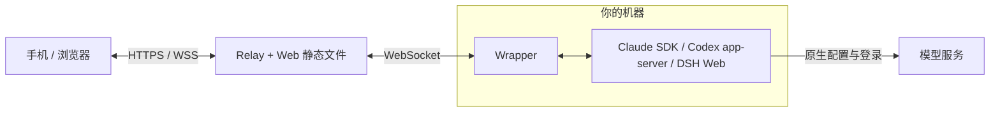

# cc-remote

**在手机和浏览器里，继续使用你机器上的 Claude Code、Codex 和 DeepSeek Harness。**

自托管 · 多会话 · 多设备 · 实时工具过程 · Code / Work · PWA

**产品版本：v3.0.0** · Wire protocol v65

[English](README_en.md) · [功能对照](#引擎与功能) · [快速开始](#快速开始) ·
[安装与升级](#安装与升级) · [文档](#文档) · [更新记录](CHANGELOG_zh.md)

cc-remote 把本机 agent 的会话、工具过程、文件和运行控制带到远端。你可以在电脑上
开始任务，用手机查看进度、回答询问、补充指令，再回到原来的会话继续工作。
模型登录、供应商配置和工具执行仍由本机引擎负责；cc-remote 不代理模型 API。

本文说明当前源码的能力。安装已发布包时，请阅读对应 tag 的文档；产品版本号相同，
也不代表不同提交的功能和协议相同。


## 可以做什么

- **同时处理多个任务**：会话按目录分组，支持搜索、置顶、重命名和后台运行。
  切换页面不会停止任务；历史按需加载，工具细节展开后再读取。
- **跟进完整过程**：查看流式回复、引擎公开的思考摘要、计划、工具调用、命令输出、
  文件改动和审批。Codex 与 DSH 运行中支持引导或排队；Claude 支持打断并发送或排队。
- **管理长任务**：通过 `/goal` 设置目标，查看进展并使用各引擎原生的预算与控制。
  Claude、Codex 还支持 `/btw` 临时侧聊，主任务继续运行。
- **直接查看文件**：聊天里的文件和目录链接连接到 `/open` 与预览面板，支持源码、
  Markdown、图片、HTML、PDF、音频和 XLSX。
- **连接多台机器、多个账号**：设备中心提供配对、切换和撤销；Claude/Codex
  可配置独立账号，分别使用原生登录、会话和扩展目录。
- **适合手机使用**：紧凑的引擎菜单、明暗主题、图片缩放、PWA 和可选后台通知。
  通知默认只显示通用状态，显示会话名称需要主动开启。

### Code 与 Work

**Code** 面向你选择的项目目录，用于开发、调试和日常 agent 任务，支持三种引擎。

**Work** 是 Claude/Codex 的独立工作区，适合文档、表格、演示和资料整理。它有私有
项目、文件／链接／笔记资料库、工作模板、Artifacts，以及一次、每日、每周定时任务。
每项工作使用独立目录，需要的材料通过附件或资料库加入。Work 的会话、资料与 Code
分开；DSH 当前没有 Work。

## 引擎与功能

下表描述 **cc-remote 已接入的能力**。模型、权限和扩展目录仍以所选设备上的原生
引擎为准；DSH 的命令还取决于创建会话时选择的 Agent Preset。

| 能力 | Claude Code | Codex | DeepSeek Harness（DSH） |
|---|---|---|---|
| 接入方式 | 日常 Claude CLI + Agent SDK | 官方 app-server，共享 daemon | 本机 Web profile + cc-remote bridge |
| Code / Work | 两者支持 | 两者支持 | 仅 Code |
| 模型与思考 | 原生模型与支持的档位 | 原生模型、思考强度、服务档位 | 仅 DeepSeek V4.1 Flash；原生思考档位 |
| Plan | 原生 Plan 模式 | 原生 Plan 协作模式 | Standard / PTC 的原生 `/plan` |
| Goal | 完成条件、检查轮次、最近检查结果、Token 用量和耗时 | 目标、可选 Token 预算、暂停／继续、完成和清除 | 目标、原生轮数上限、自动续行状态、暂停／继续和清除 |
| `/btw` 临时侧聊 | 支持 | 支持 | 未接入 |
| 归档与删除 | 归档、恢复、删除 | 归档、恢复、删除 | 仅单向归档；归档后仍可读历史、导出 |
| 会话派生 | 支持 | 支持；可派生到独立 worktree | 支持在已完成边界、同目录派生 |
| 特有工具 | Hooks 管理、原生询问与工具审批 | Review、空闲会话目录迁移、状态与账号限额 | 子代理、后台任务、文件／会话引用、完整会话 ZIP 导出 |
| 扩展 | Skills、插件、MCP、Hooks 等，按能力管理 | Skills、插件、Apps、MCP；Hooks 只读 | 原生命令与 Skills；安装配置留在 DSH |

**DSH 接入版本为 `0.1.5-rc.2`。** 新会话可选择 **标准（Standard）** 或 **PTC**
Preset 使用这里描述的 Goal／Plan。旧 Minimal 会话保持原来的能力；切换模型、
思考强度或权限不会改变 Preset，需要从“新会话 → Agent Preset”创建相应会话。
DSH 的 Plan 用来组织规划流程，不会替代权限设置或收紧工具沙箱。
详见 [DSH 接入、模式与功能边界](integrations/dsh/README.md)。

### Goal 的预算不是上下文窗口

`/goal` 打开当前引擎的目标小窗，三家的控制分别对应原生能力：

- **Claude** 使用完成条件和原生检查反馈；展示用量与耗时，没有 Codex 式 Token 预算输入。
- **Codex** 可设置目标累计 Token 预算，或不设预算；预算不用于扩大上下文窗口。
- **DSH** 使用原生轮数上限，创建时默认 256 轮；轮数耗尽后，增加上限和恢复续行是两个操作。

## 常用操作

在输入框输入 `/` 查看当前引擎实际可用的命令。

| 入口 | 用途 |
|---|---|
| `/model` | 选择模型与思考强度 |
| `/goal` | 打开目标小窗；DSH 需要相应 Preset |
| `/plan` | 进入计划模式；Claude/Codex 用 `/normal` 退出，DSH 用 `/plan off` |
| `/btw [问题]` | 在 Claude/Codex 中创建基于当前会话的临时侧聊 |
| `/open [路径]` | 浏览目录；也可从“更多 → 会话文件”进入 |
| `/preview <路径>` | 打开文件预览 |
| `/diff` | 查看当前项目的 Git 改动 |
| `/context` | 查看上下文用量；输入框旁的小圈也是入口 |
| `/autocompact` | Claude/Codex 的会话级上下文设置，语义见下文 |
| `/status` | Codex 的线程、配置、用量和账号限额 |
| `/skills` | 查看当前引擎的 Skills；Claude/Codex 另有 `/extensions` 等目录入口 |

桌面输入默认 **Enter 发送、Shift+Enter 换行**。助手询问小窗同样支持这组按键，
**Esc** 只关闭小窗，问题仍保持未回答。中文输入法确认候选字时不会提交。

### 上下文与自动压缩

在 **Codex Code** 中，`/autocompact 300k` 表示当前会话的最大可用上下文是
**300,000 tokens**，自动压缩目标约为上限的 **95%**；实际生效阈值以小窗显示和
Codex 原生限制为准。进度使用原生压缩估算，不把最近一次模型请求用量当作压缩依据。
暂时读取失败会保留同一会话、同一模型的最近有效值，后台刷新不会反复显示读取提示。

运行中保存的设置可能处于待应用状态，要等会话空闲且其他客户端释放后才生效。
`/autocompact default` 恢复默认值；该 Codex 设置不适用于 Work 或临时侧聊。
切换到容量更小的模型前，应先恢复默认设置。

**Claude** 默认沿用原生自动压缩行为，也可显式选择自动或 `100K–1M` 的会话窗口；
降低窗口会先确认原生 compact 边界。**DSH** 展示原生上下文估算与模型容量，
不提供 Codex 的窗口覆盖设置。查看上下文不会创建模型回合。

## 文件与预览

Code 的 `/open` 从会话目录开始，可以进入上级目录、输入绝对路径或 `~`。
只要运行 Wrapper 的用户有系统读取权限，就可以查看普通文件，无需文件所有者与
运行用户相同。外部文件默认只读；Work 仍限于自己的工作目录。目录按需分页，
不递归扫描，也不打开符号链接和特殊文件。

| 文件 | 预览方式与边界 |
|---|---|
| 源码、文本、Markdown | 行号定位、渲染预览；本会话成功写入的 Markdown 可做冲突安全编辑 |
| 图片、PDF | 直接预览；图片支持灯箱和缩放 |
| 音频 | 播放、拖动进度、调速和下载；单文件最多 8 MiB，编码支持取决于浏览器 |
| XLSX | macOS/Linux 均可直接看工作表和已保存的单元格值，无需 Office；不计算公式或执行外部链接。预览有大小、行列和总单元格上限，截断会提示，可下载原文件 |
| DOC/DOCX/ODT/RTF、XLS/ODS、PPT/PPTX/ODP | Linux Wrapper 上使用 LibreOffice + bubblewrap 临时转换成 PDF；缺少转换环境时不可预览 |
| HTML | 普通文件预览经过清理，禁用脚本；需要交互的多文件静态页面使用 [远程 Viewer](docs/remote-viewer.md) |

预览解析／转换发生在 Wrapper 主机或浏览器，文件通过鉴权连接返回给请求者。
Relay 不落盘原文件或预览结果。Viewer 默认复用主站地址，不需要额外预览域名，
也不代理任意内网服务。

## 架构



Wrapper 主动出站连接 Relay，设备不需要开放公网入站端口。Relay 负责控制链路，
原生引擎直接连接其模型服务；两条链路的配置相互独立。

<a id="本地快速开始一台机器5-分钟"></a>

## 快速开始

先在 agent 所在机器本地运行 Relay、Wrapper 和网页。源码开发／构建使用
**Python 3.13、Node 24**，与 CI 及 [`.nvmrc`](.nvmrc) 保持一致。

至少准备一个可用引擎：

- **Claude**：日常 Claude Code `>= 2.1.258`，默认路径 `~/.local/bin/claude`。
  Wrapper 使用该 CLI；Python Agent SDK 固定为 `0.2.151`。
- **Codex**：已登录的官方 CLI。共享控制需要同时支持
  `codex app-server daemon --help` 和 `codex app-server proxy --help`。
- **DSH**：独立安装并启动 `0.1.5-rc.2` Web profile，按
  [接入说明](integrations/dsh/README.md) 配置 bridge 和本机配对文件。

### 1. 安装依赖并构建

```bash
git clone https://github.com/muggle-stack/cc-remote.git
cd cc-remote
# 要使用某个开发分支的功能，请先切到该分支，再安装和构建。
python3.13 -m venv .venv
.venv/bin/python -m pip install --require-hashes --only-binary=:all: -r requirements.lock
# 以下命令使用 Node 24。
npm --prefix web ci
npm --prefix web run build
```

### 2. 配置本地连接

首次配置时复制模板；已有 `.env` 请直接编辑，保留原来的密钥。

```bash
install -m 600 .env.example .env
openssl rand -hex 32   # 生成 SESSION_SECRET
openssl rand -hex 32   # 单独生成 WRAPPER_TOKEN
```

在 `.env` 中填写实际值，尖括号内容为待替换的占位说明：

```ini
LOGIN_PASSWORD=<强网页登录口令>
SESSION_SECRET=<第一条随机值>
WRAPPER_TOKEN=<第二条随机值>
PUBLIC_ORIGIN=http://127.0.0.1:8765
RELAY_URL=ws://127.0.0.1:8765/ws
WEB_STATIC_DIR=web/dist
CC_CWD=/absolute/path/to/project
CLAUDE_BIN=
```

`CLAUDE_BIN` 留空使用默认路径；覆盖时填写完整绝对路径。DSH 的
`CC_REMOTE_DSH_CONNECTION_FILE` 另按接入文档设置。
本地 `.env` 只用于开发体验，生产凭据存放方式见 [安装文档](docs/installation.md)。

### 3. 启动

在仓库目录下开两个终端，分别运行：

```bash
# 终端 1
.venv/bin/python -m cc_remote.relay
```

```bash
# 终端 2
.venv/bin/python -m cc_remote.wrapper
```

打开 [http://127.0.0.1:8765](http://127.0.0.1:8765)，使用配置的口令登录。
先确认设备在线，再选择引擎和会话。此地址用于本机访问；手机接入请使用下方的
公网部署，或配置受限的 LAN/Tailscale 入口。

<a id="github-release-一键安装生产推荐"></a>
<a id="生产部署公网-vps-中继--你机器上的-wrapper"></a>

## 安装与升级

| 场景 | 文档 |
|---|---|
| 使用当前功能（推荐）、部署开发分支 | [源码部署](docs/installation.md#source-install)：使用同一份测试通过的快照 |
| 安装指定已发布版本 | [Release 包安装](docs/installation.md#release-install)：先确认该 tag 包含需要的功能；Relay 为 Linux，Wrapper 支持 macOS 与 glibc Linux，均提供 x86_64 / arm64 包 |
| 容器或现有反向代理 | [部署参考](deploy/README.md#container-deploy-docker-and-the-nginx-alternative) |
| 添加 DSH | [本机 Web profile、bridge 与配对](integrations/dsh/README.md#connect-a-local-dsh) |

生产 Relay 使用 `/opt/cc-remote/releases/` 中的不可变版本，通过
`/opt/cc-remote/current` 原子切换。升级前保留外部配置与私有状态快照；Relay、Web
和所有 Wrapper 必须来自同一份源码快照或配套安装包，协议不一致会拒绝连接。

部署流程、回滚和验收以 [deploy/README.md](deploy/README.md) 为准。
AI 协助部署使用仓库 [部署 Skill](.agents/skills/cc-remote-deploy/SKILL.md)。
Codex 需核对每个账号的 CLI 与 Wrapper 共用官方 daemon；已安装的 Codex App
接入是单独的可选步骤，提供 [macOS](docs/codex-desktop-launcher.md) 和
[Linux](docs/codex-desktop-linux.md) 流程，不影响核心部署结果。
升级 cc-remote 不会代替你升级或重启 DSH。

## 配置与原生客户端

- **Claude**：原生 CLI／Desktop／Agent View 持有的会话先只读镜像；由用户明确接管后，
  Remote 才恢复写入。官方 `claude` 命令保持原样。
- **Codex Code**：通过官方共享 daemon 与原生客户端协同。私有 stdio 降级不具备
  同样的双向共享能力，部署验收不能把它当作共享成功；Work 使用私有进程。
- **DSH**：Wrapper 连接已经运行的本机 Web 服务。关闭 Wrapper 只断开订阅，
  原生任务继续运行；界面的停止按钮才会显式取消任务。

账号目录、代理、设备授权、通知和环境变量见 [配置、账号与数据](docs/configuration.md)。
Claude/Codex 多账号的配置和登录各自隔离；账号选择不会把凭据发给网页或 Relay。

<a id="安全须知务必读"></a>

## 安全与数据

**能登录并使用 Code 的人，应视为拥有 Wrapper 主机上的远程 agent／shell 权限。**
Code 默认权限较宽；Work 的私有目录策略不能替代独立系统用户、容器或虚拟机隔离。

- 公网使用 HTTPS/WSS；凭据放在源码和 release 目录外。Linux 生产服务使用
  root-only 环境文件，macOS 安装器使用当前用户的私有配置。
- 网页通过 HttpOnly、SameSite=Strict Cookie 登录，WebSocket 校验精确 Origin；
  Wrapper 使用请求头凭据，设备授权按 `machine_id` 隔离。
- 会话源文件和 Work 数据保存在设备上，浏览器会缓存历史投影。Relay 转发会话流量，
  不持久化对话或 Artifact；设备登记和 Push 订阅等控制元数据会持久化。
- 浏览历史与读取上下文不会发起模型请求。发送消息、侧聊和 Goal 原生续行仍按所用
  模型账号计费。

## 文档

| 文档 | 内容 |
|---|---|
| [安装与升级](docs/installation.md) | Release、源码、配对、网络入口 |
| [配置、账号与数据](docs/configuration.md) | 多账号、环境变量、鉴权、队列与历史边界 |
| [部署流程](deploy/README.md) | 不可变发布、回滚、共享控制与上线验收 |
| [DSH 接入](integrations/dsh/README.md) | 原生 Preset、Goal／Plan、搜索、子代理、导出与限制 |
| [远程 Viewer](docs/remote-viewer.md) | 交互式静态页面、Bridge／Isolated 模式 |
| Codex App 接入：[macOS](docs/codex-desktop-launcher.md)／[Linux](docs/codex-desktop-linux.md) | 可选桌面 App、日常 CLI 与 Wrapper 共用 daemon |
| [Codex App 工具](docs/codex-app-tools.md) | 可选 App-control MCP |
| [更新记录](CHANGELOG_zh.md) | 版本变化与迁移记录 |

## 开发

前端使用 Node 24；Python 依赖按仓库锁文件安装。常用零模型测试：

```bash
.venv/bin/python -m pip install -r requirements-dev.txt
.venv/bin/python -m pytest
npm --prefix web run test:reliability
npm --prefix web run test:history-browser
npm --prefix web run test:viewer
npm --prefix web run test:dsh
npm --prefix web run lint
npm --prefix web run build
```

完整提交／PR 门禁见 [AGENTS.md](AGENTS.md#commit-and-pr-gate)。
[真实链路脚本](scripts/live/) 与 [DSH 隔离验收](integrations/dsh/README.md#verification)
单独运行；真实模型探针可能消耗额度，不属于默认单元测试。
网页开发服务器使用 `npm --prefix web run dev`，同源联调使用构建后的 Relay 网页。

## FAQ

- **DSH 的 `/goal`、`/plan` 为什么不可用？** 先检查会话 Preset。Minimal 不提供这两项，
  应新建 Standard／PTC 会话；若一直显示命令读取失败，再检查 DSH bridge 与配对连接。
- **为什么文件能列出却不能预览？** 除系统读取权限外，预览还要求普通文件、支持的格式和
  大小。XLSX 无需 Office；其他 Office 格式在缺少 Linux 转换沙箱时不能直接预览。
- **重启后历史会丢吗？** 已落盘历史保留。实时尾流和普通待执行队列是有界内存状态，
  不保证跨 Wrapper 重启恢复；Work 定时任务另有持久化记录。
- **Relay 重启或更换会怎样？** 浏览器需要重连、重新登录；设备上的会话保留。
  换 Relay 时还要迁移或重建设备授权、Push 等控制配置，不能只修改连接地址。
- **手机访问需要给电脑开公网端口吗？** 不需要。Wrapper 主动出站连接 Relay；
  公网入口位于 Relay 主机。

<details>
<summary>更多界面截图</summary>

以下为 Claude/Codex 的界面示例；不同引擎和版本的菜单会有所区别。


</details>

## 许可

MIT — 见 [LICENSE](LICENSE)。
