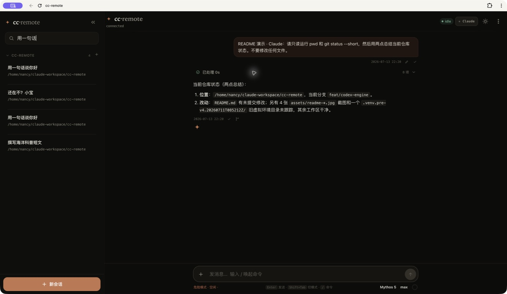

# cc-remote

<p align="center"><strong>把你机器上的 Claude Code / Codex，带到手机和任意浏览器。</strong></p>
<p align="center">自托管 · 双引擎 · 多会话 · 实时过程 · 响应式 Web</p>
<p align="center">
  <a href="README_en.md">English</a> ·
  <a href="#本地快速开始一台机器5-分钟">5 分钟上手</a> ·
  <a href="#生产部署公网-vps-中继--你机器上的-wrapper">生产部署</a> ·
  <a href="#安全须知务必读">安全须知</a>
</p>

cc-remote 是一个开源的远程控制面：本机 `wrapper` 驱动已经安装并登录的
`claude` / `codex`，浏览器通过你自托管的 WebSocket 中继查看和控制会话。
模型、认证与工具执行仍由本地 CLI 决定；cc-remote 不代理模型 API，也不会把
API key 烤进网页。

<p align="center">
  
</p>

---

## 目录

- [核心能力](#核心能力)
- [架构](#架构)
- [真实界面与实用功能](#真实界面与实用功能)
- [本地快速开始（一台机器，5 分钟）](#本地快速开始一台机器5-分钟)
- [生产部署（公网 VPS 中继 + 你机器上的 wrapper）](#生产部署公网-vps-中继--你机器上的-wrapper)
- [环境变量](#环境变量)
- [鉴权模型](#鉴权模型)
- [可靠性边界](#可靠性边界)
- [安全须知（务必读）](#安全须知务必读)
- [模型后端（可选）](#模型后端可选)
- [开发](#开发)
- [FAQ](#faq)
- [许可](#许可)

---

## 核心能力

| 场景 | 可以做什么 |
|---|---|
| **双引擎** | 在同一个 Web UI 中使用 Claude Code 和 Codex；每个会话保持自己的模型、思考强度、权限与运行状态。 |
| **远程操作** | 手机、平板或桌面浏览器实时看流式回复，发送附件，排队下一条消息，随时打断当前回合。 |
| **完整过程** | 折叠展示引擎公开提供的 reasoning 摘要、计划、命令输出、文件 diff、MCP、协作代理、Hook 和终端交互事件。 |
| **人工确认** | 回传 Claude `can_use_tool`，以及 Codex 命令、文件修改、用户输入、通用权限和 MCP elicitation；终端占用时可只读镜像，也可由用户主动接管。 |
| **会话管理** | 搜索、切换、重命名、归档和消息级派生；Codex 还可在 Git 仓库中派生到独立 worktree。 |
| **运行控制** | 切换模型、思考强度、服务档位、权限和 Plan 模式；`/goal` 管理长目标，Codex `/status` 读取 app-server 状态、用量与限额。 |
| **连续性** | 后台会话继续运行，多端实时同步；从 Claude transcript / Codex rollout 分页恢复历史，断线后按游标补流。 |
| **自托管** | wrapper 只出站连接；VPS 不需要模型 SDK，网页认证使用 HttpOnly cookie，CLI 凭据与 API key 不进入前端。 |

> 不同引擎可用的模型、服务档位和运行控制以本机 CLI 及其 SDK/app-server 能力为准。

## 架构

两条**互相独立**的链路：

```
模型链路（cc-remote 不碰）:  claude / codex ──(各自本地配置)──▶ 模型服务

控制链路（本仓库）:          浏览器 ⇄ 中继(WebSocket) ⇄ wrapper ⇄ SDK / app-server ⇄ 本地 CLI
```

| 组件 | 跑在哪 | 干什么 |
|---|---|---|
| **wrapper** | `claude` / `codex` 所在的机器 | 持有会话池、把 SDK/app-server 事件翻成线协议、管打断/排空、按需从 transcript/rollout 读历史。**只出站连中继，机器不需要开入站端口。** |
| **relay（中继）** | 公网 VPS（或本地） | 纯 WebSocket 转发器（FastAPI）。wrapper 使用 Bearer token，浏览器使用 HttpOnly 会话 cookie；单 wrapper 槽、多客户端扇出。**从不 import `claude-agent-sdk`、从不碰模型 API**。 |
| **web** | 浏览器 | React 客户端；中继同源托管它的静态文件（`web/dist`）。 |

## 真实界面与实用功能

以下截图来自实际运行中的 cc-remote，不是设计稿。

### 多会话管理：后台继续跑，随时切回来

左侧会话池按工作目录分组，可以搜索、切换、重命名和归档会话；一个会话在后台处理时，仍可进入另一个会话继续工作，切回来即可看到完整实时进度。Claude Code 与 Codex 会话共用同一套工作台，但各自保留独立的上下文、模型、权限和运行状态。

<p align="center">
  
</p>

### Claude Code：思考、工具调用和 Hook 都能看见

Claude 会话不是一个只显示最终文字的简化聊天框。Remote 会接收 Claude Code SDK 暴露的思考、命令调用、工具结果和 Hook 生命周期，按发生顺序折叠展示；底部同时显示 Claude 当前模型、思考强度、权限模式和上下文占用。

<p align="center">
  
</p>

### 新会话：先选引擎和工作目录

一个入口创建 Claude Code 或 Codex 会话；工作目录可浏览选择，第一条消息可直接带图片或文件。会话建立后再按需要调整模型、权限和 Plan 模式，不用先填写一排默认参数。

<p align="center">
  
</p>

### Codex：计划与处理过程完整保留

Codex 会话把 app-server 提供的 reasoning 摘要、计划、命令、diff、MCP、协作代理与 Hook 组织成可折叠时间线。运行中可以展开追踪细节，完成后收起为一行摘要；最终答复始终独立显示。

<p align="center">
  
</p>

### Codex 会话级控制：模型、思考、权限与状态

模型、思考强度、服务档位和权限都绑定当前会话；可以在不改本机全局配置的情况下调整下一回合。输入区同时提供附件、排队/打断、上下文占用以及 `/goal`、`/status` 等命令入口。

<p align="center">
  
</p>

### 常用操作速查

- **会话**：新建、搜索、后台运行、重命名、归档、派生、Codex worktree。
- **回合**：流式输出、排队、打断、复制、编辑重发、从指定消息派生。
- **工具**：命令输出、文件修改与 diff、MCP、协作代理、Hook、审批和用户输入回传。
- **终端协同**：检测原生 CLI 占用，实时镜像新消息；远端用户保留主动接管权。
- **状态**：模型、思考强度、权限、Plan、上下文、目标、用量、rate limit 和运行告警。
- **设备**：响应式手机界面、深浅主题、多浏览器同步与断线重连。

## 本地快速开始（一台机器，5 分钟）

先在 **agent CLI 所在的那台机器**上把中继 + wrapper + 网页都跑起来，验证整条链路。生产部署见下一节。

### 前置

- 一台已装好 **Claude Code CLI**（`claude`，v2.1.51+）或支持 `app-server` 的 **Codex CLI**（`codex`）并且 CLI **本身已经能正常对话**的机器；两个都装即可在网页中切换引擎。
- **Python 3.10+**、**Node 20.19+**（用来构建网页）。

### 1）装依赖 + 构建网页

```bash
git clone https://github.com/muggle-stack/cc-remote.git && cd cc-remote

python3 -m venv .venv && source .venv/bin/activate
pip install --require-hashes --only-binary=:all: -r requirements.lock

npm --prefix web ci
npm --prefix web run build          # 产出 web/dist/
```

### 2）配置

```bash
install -m 600 .env.example .env
```

编辑 `.env`，至少改这几项：

```ini
# 网页登录口令（自己定一个强口令）
LOGIN_PASSWORD=<一个强口令>
# 给会话 token 签名用的密钥
SESSION_SECRET=<openssl rand -hex 32>
# wrapper ⇄ relay 的共享 token
WRAPPER_TOKEN=<openssl rand -hex 32>
# 浏览器访问中继时的精确来源；本地 HTTP 只允许 loopback
PUBLIC_ORIGIN=http://127.0.0.1:8765
# 让中继同源托管网页
WEB_STATIC_DIR=web/dist
# agent 会话的默认工作目录（你要让它操作的项目目录）
CC_CWD=/path/to/your/project
# systemd/PATH 找不到 Claude CLI 时可显式指定；否则留空
CLAUDE_BIN=/absolute/path/to/claude
```

> 本地 loopback 快速体验时，中继和 wrapper 可读同一个 `.env`；它不适合生产。
> 公网 wrapper 必须按下文使用 root-only `/etc/cc-remote/wrapper.env`，避免
> `bypassPermissions` 模型/工具直接读取控制面密钥。

### 3）跑起来（两个终端）

```bash
# 终端 1：中继（同源提供 网页 + /ws + /api，监听 http://127.0.0.1:8765）
python -m cc_remote.relay

# 终端 2：wrapper（驱动本地 claude / codex）
python -m cc_remote.wrapper
```

### 4）打开网页

浏览器开 **http://127.0.0.1:8765** → 用 `LOGIN_PASSWORD` 登录 → 发条消息，应能看到流式回复、可打断、可多会话切换。

> 想改网页代码时用开发模式：`npm --prefix web run dev`（Vite）。生产/联调直接用上面的 `build` + 中继同源托管更简单。

## 生产部署（公网 VPS 中继 + 你机器上的 wrapper）

把中继搬到公网，wrapper 从你的机器**出站** `wss://` 连它，手机浏览器连同一个域名。模型链路完全不动。

```
你的机器 wrapper ──wss:443──▶ Caddy(VPS, 自动 HTTPS) ──▶ relay(127.0.0.1:8765) ◀──wss:443── 手机浏览器
                                                              └─ 同源托管 web/dist
```

### 前置

- **VPS**：Ubuntu 22.04+ / Debian 12+（或其他自带 Python 3.10+ 的 Debian 系发行版），放行 **80 + 443**（80 给 Let's Encrypt 验证，443 给 wss）。
- **域名**：A 记录指向 VPS 公网 IP（Caddy 自动签 + 续 Let's Encrypt 证书）。
- **你的机器**：Linux（下面用 systemd 常驻 wrapper），出站 443 到公网放行。

### 1）生成 token / 口令

```bash
openssl rand -hex 32   # WRAPPER_TOKEN（relay 与 wrapper 两边要一致）
openssl rand -hex 32   # SESSION_SECRET（relay 用）
# 再想一个 LOGIN_PASSWORD（网页登录口令）
```

### 2）在 dev 机器构建网页

```bash
npm --prefix web ci
npm --prefix web run build   # 产出 web/dist/
```

> 现在网页**不再把 token 烤进 JS**：登录改为向中继 POST 口令换取短期会话 token。所以构建不需要任何 `VITE_*` 变量。

> **升级到协议 v8**：线协议会严格拒绝版本不一致。请在同一次维护窗口部署
> `cc_remote/` 和新的 `web/dist/`，然后依次重启 relay、wrapper；不要新旧版本滚动混跑。
> 升级期间已有 WebSocket 会短暂重连，relay 重启也会要求浏览器重新登录。已打开的
> 旧版页面必须做一次**硬刷新**（重新加载新的带 hash 静态资源），仅重新登录不够。
> 手工发布时先停本机 wrapper，再停服更新 relay + web，最后启动 v8 relay 和
> v8 wrapper；这样旧 wrapper 不会占住 relay 的单连接槽。

### 3）停服维护窗口内，从 staging 发布到 VPS

```bash
# dev 机器：普通账号只写自己的 staging，不直接写 root-owned /opt
rsync -av --delete --exclude='.git' --exclude='.venv' \
  --exclude='web/node_modules' --exclude='.env' \
  ./ <vps-user>@<vps>:~/cc-remote-upload/

# VPS：协议 v8 的 Python + web/dist 在停服窗口一起发布，避免混跑
ssh <vps-user>@<vps>
sudo systemctl stop cc-remote-relay 2>/dev/null || true
sudo mkdir -p /opt/cc-remote
sudo rsync -a --delete --exclude='.env' --exclude='.venv' \
  ~/cc-remote-upload/ /opt/cc-remote/
```

确保 VPS 上有：`/opt/cc-remote/cc_remote/`、`web/dist/cc-remote-build.json`、`requirements.lock`、`deploy/`。升级也重复同一套 staging + 停服发布，不能直接 rsync 正在运行的目录。

### 4）VPS：配 `.env` + 一键 setup

```bash
# 在 VPS 上（/opt/cc-remote 安装后由 root 持有）
sudo test -f /opt/cc-remote/.env || sudo install -m 600 \
  /opt/cc-remote/deploy/env.relay.example /opt/cc-remote/.env
sudoedit /opt/cc-remote/.env     # 填 LOGIN_PASSWORD / SESSION_SECRET / WRAPPER_TOKEN

# 装依赖 + Caddy + systemd（把域名换成你的）
sudo bash /opt/cc-remote/deploy/setup-vps.sh your-domain.com
```

脚本会：装 `python3-venv` + Caddy、建 `ccremote` 系统用户、建 venv + `pip install`、把带标记的 cc-remote 站点块和全局 HTTP 超时/头大小上限合并进 Caddyfile（保留其他全局项和站点），再启动 `cc-remote-relay` + `caddy`。若新 relay 重启或健康检查失败，venv、Caddyfile、systemd unit 会作为一个事务全部恢复，并验证旧 relay 的 `/healthz`。

验证：

```bash
curl https://your-domain.com/healthz
# 期望：{"ok":true,"wrapper_connected":false,"clients":0}
```

### 5）你的机器：配 root-only wrapper 环境 + systemd

```bash
cd /path/to/cc-remote
python3 -m venv .venv
.venv/bin/pip install --require-hashes --only-binary=:all: -r requirements.lock

# 密钥源由 root 持有；模型/工具使用你的普通用户运行，不能直接读取该文件。
sudo install -d -o root -g root -m 0755 /etc/cc-remote
sudo install -o root -g root -m 0600 deploy/env.wrapper.example \
  /etc/cc-remote/wrapper.env
sudoedit /etc/cc-remote/wrapper.env  # 填 RELAY_URL / WRAPPER_TOKEN / CC_CWD

# 装 systemd 服务（先编辑 User、仓库/venv/home 路径；不要改回仓库 .env）
sudo cp deploy/cc-remote-wrapper.service /etc/systemd/system/
sudo systemctl daemon-reload && sudo systemctl enable --now cc-remote-wrapper
journalctl -u cc-remote-wrapper -f     # 期望：connected to relay / wrapper running
```

回 VPS 再看 `curl https://your-domain.com/healthz` → 应 `wrapper_connected:true`。

### 6）手机验证

手机浏览器（任意网络）开 `https://your-domain.com/` → 用 `LOGIN_PASSWORD` 登录 → 发消息，应看到流式回复 + 可打断 + 多端同步。

### 公司/内网走 HTTP 代理出网？

wrapper 用 `websockets` 出站，认 `HTTPS_PROXY` / `ALL_PROXY` 环境变量。在
`/etc/cc-remote/wrapper.env` 加：

```ini
HTTPS_PROXY=http://your-proxy:port      # SOCKS 用 ALL_PROXY=socks5://...
```

（若代理做 TLS 中间人，需把它的根证书加进系统信任。）

## 环境变量

**中继（relay）**

| 变量 | 默认 | 说明 |
|---|---|---|
| `RELAY_HOST` / `RELAY_PORT` | `127.0.0.1` / `8765` | 监听地址（公网部署交给 Caddy，保持 127.0.0.1）。 |
| `LOGIN_PASSWORD` | 空 | 网页登录口令。**必须设**，否则没法登录。 |
| `SESSION_SECRET` | 空 | 给会话 token 签名的 HMAC 密钥。**必须设**（`openssl rand -hex 32`）。 |
| `SESSION_TTL_SECONDS` | `604800` | 会话 token 有效期（默认 7 天）。 |
| `LOGIN_BODY_MAX_BYTES` / `LOGIN_READ_TIMEOUT` / `LOGIN_INFLIGHT_CAP` | `4096` / `10` / `32` | 登录请求体字节数、总读取秒数和并发读取数的硬上限。 |
| `SESSION_REGISTRY_CAP` | `1024` | 进程内可撤销浏览器会话注册表的硬上限。 |
| `PUBLIC_ORIGIN` | 空 | 浏览器允许连接 WS 的精确来源，如 `https://remote.example.com`；**必须设**，非 loopback 必须 HTTPS。 |
| `WRAPPER_TOKEN` | 占位值 | wrapper 连中继时的 Bearer token，两边必须一致；启动会拒绝占位值和短值。 |
| `WEB_STATIC_DIR` | 空 | 指向 `web/dist` 则同源托管网页；留空则只做 API/WS。 |
| `CLIENT_QUEUE_CAP` / `CLIENT_QUEUE_BYTES` | `4096` / `16777216` | 单客户端待发帧数/字节硬上限；超限断开慢客户端，不静默丢帧。 |
| `MAX_CLIENTS` / `CLIENT_HELLO_TIMEOUT` | `8` / `10` | 已接受客户端总数和首个 Hello 帧等待秒数的硬上限。 |
| `WS_MAX_SIZE_BYTES` | `16777216` | relay 与 wrapper 接受的单个 WebSocket 帧上限。 |

**wrapper**

| 变量 | 默认 | 说明 |
|---|---|---|
| `RELAY_URL` | `ws://127.0.0.1:8765/ws` | 中继的 WebSocket 地址（公网用 `wss://域名/ws`）。 |
| `WRAPPER_TOKEN` | `change-me-wrapper` | 同中继。 |
| `CLAUDE_BIN` | 空 | 可选的 Claude CLI 绝对路径；systemd/PATH 找不到 `claude` 时设置。 |
| `CC_CWD` | 当前目录 | 新会话默认工作目录。Claude `--resume` 靠它定位 `~/.claude/projects/` 下的会话文件，**必须对**；Codex 恢复时会优先从 rollout 取原 cwd。 |
| `CC_RESUME_SESSION_ID` | 空 | 恢复指定会话 UUID；留空开新会话。首次启动后 id 会持久化到 `~/.cc-remote/`。 |
| `MAX_CONCURRENT_SESSIONS` | `20` | 常驻 agent 子进程上限（内存随引擎/版本变化）。超了就驱逐 idle 的；客户端缓存仍在，可再切回。 |
| `DRAIN_TIMEOUT` | `15` | interrupt 后等终止 ResultMessage 的秒数，超时强制重连（排空保险）。 |
| `CODEX_TURN_IDLE_WARN_SECONDS` | `90` | Codex app-server 连续无事件时显示“仍在等待”提示；`0` 禁用。只提示，不自动打断 ultra 推理或长工具。 |
| `RING_MAX_EVENTS` / `RING_MAX_BYTES` / `TOOL_RESULT_MAX` | 见 `.env.example` | 实时尾巴缓冲 / 工具输出截断上限调优。 |
| `HISTORY_SOURCE_MAX_BYTES` | `67108864` | 单个 transcript/rollout 源文件读取上限；超限返回明确错误，避免全量解析耗尽内存。 |
| `WRAPPER_INBOX_CAP` / `WRAPPER_SEND_QUEUE_CAP` | `1024` / `8192` | wrapper 入站/出站内存队列条数硬上限。 |
| `WRAPPER_INBOX_BYTES` / `WRAPPER_SEND_QUEUE_BYTES` | `33554432` / `33554432` | wrapper 入站/出站队列序列化字节硬上限。 |
| `TURN_READER_QUEUE_CAP` | `4` | 单回合 SDK/app-server 读取队列上限；满时向模型流施加背压。 |

单次消息最多 8 个附件，单个最多 6 MiB，解码后合计最多 8 MiB；超限会在启动模型前拒绝。

## 鉴权模型

- **网页客户端**：向中继 `POST /api/login`（带 `LOGIN_PASSWORD`）换一个短期 HMAC 会话，放在 **HttpOnly + SameSite=Strict** cookie 中；JavaScript 读不到，URL 中也没有 token。WebSocket 还必须通过精确 `Origin` 校验。
- **wrapper ⇄ 中继**：WS 握手时带 `Authorization: Bearer <WRAPPER_TOKEN>`。
- token 只走 cookie/请求头，从不进 URL 或线协议消息体；日志会自动打码 token/password 字段。

## 可靠性边界

- Web 与 TUI 会给可重试命令附加稳定的 `cmd_id`，断线重连或 wrapper 恢复后重发；wrapper 在同一进程生命周期内去重并返回 ACK。每个实时会话还用 wrapper generation 配对 cursor，避免 wrapper 重启后把旧序号误当成新序号。
- 未确认命令队列和通用命令去重表是**有界内存状态**：浏览器硬刷新、TUI 退出或 wrapper 进程崩溃，不承诺跨进程的 exactly-once。cc-remote 是交互控制面，不是持久任务队列；这类故障后应先核对 transcript/rollout 和会话状态，再决定是否重发。
- 已落盘的 Claude transcript / Codex rollout 是历史事实来源；实时 ring 只负责有界的断线补流，不替代历史文件。

## 安全须知（务必读）

> **cc-remote 会让远端的人在你机器上跑任意命令。请当成「给别人一个你机器的 shell」来对待。**

- Claude 会话默认使用 `permissionMode: bypassPermissions`；Codex 默认审批策略是 `never` 并继承本机 Codex sandbox 配置，也可切到 `on-request` / `untrusted`，审批请求会转到网页。无论当前界面显示什么策略，已登录客户端都能创建/切换会话和修改可用控制项。**能连到中继且通过登录的人，应等同于拿到了这台机器的远程 agent/shell 权限。**
- `LOGIN_PASSWORD` / `WRAPPER_TOKEN` / `SESSION_SECRET` 是唯一的门：用强随机值、别提交 git、别贴到聊天里、定期轮换。仓库 `.env` 只适合本机开发；生产 wrapper 必须使用上述 root-only `/etc/cc-remote/wrapper.env`。systemd 模板会禁止服务及模型子进程读取这个源文件和遗留仓库 `.env`；Linux wrapper 还会关闭 dumpability，避免子进程从 `/proc/<pid>/environ` 或进程内存取回已经捕获的 token。
- 公网必须上 TLS（`wss://`，本仓库用 Caddy 自动签证书）。别用明文 `ws://` 暴露公网。
- 建议：给中继加 IP 白名单 / 只在需要时开、给登录加失败限速（已内置每 IP 每分钟 5 次）。

## 模型后端（可选）

cc-remote **不碰模型 API**——它只驱动你机器上已经配置好的 CLI：Claude 使用 `~/.claude/settings.json`，Codex 使用自己的登录与 `~/.codex/config.toml`。所以：

- 用**官方 Anthropic API**：装好 `claude` 能对话即可，cc-remote 直接用。
- 用**兼容端点（如 GLM / z.AI）**：照常在 `settings.json` 里设 `ANTHROPIC_BASE_URL`（指向官方兼容端点或你自建的代理），cc-remote 一样只做控制链路。
- 用 **Codex**：先确保本机 `codex` 可正常对话且 `codex app-server` 可启动；cc-remote 不接触其 API key，也不会改写全局认证配置。

## 开发

```
cc_remote/
  protocol.py      # pydantic 线协议（客户端/中继/wrapper 都依赖）
  config.py        # 环境变量配置
  relay/           # FastAPI 中继：server / auth / pairing / forward
  wrapper/         # Claude SDK + Codex app-server / 会话池 / stream / ringbuffer / transport
web/               # React 客户端（Vite + TS）
tests/             # 零 token 单元测试 + 端到端脚本
deploy/            # Caddyfile / systemd / setup-vps.sh / env 示例
```

```bash
python -m pip install -r requirements-dev.txt
pytest                              # 单元测试（不触模型，零 token）
npm --prefix web run test:reliability # 前端可靠性纯测试
npm --prefix web run lint           # 前端静态检查
npm --prefix web run dev            # 网页开发模式
npm --prefix web run build          # 网页生产构建
```

贡献指南与内部架构约定见 [CLAUDE.md](CLAUDE.md)。

## FAQ

- **wrapper 重启会丢历史吗？** 已落盘历史不会；它来自磁盘上的 Claude transcript / Codex rollout。重启会丢尚未确认的内存命令和实时 ring，详见上面的可靠性边界。
- **中继重启会断吗？** 会短暂断连并要求重新登录（进程内撤销注册表会重置）；对话不丢，因为会话在 wrapper 机器上。
- **要开入站端口吗？** 不用。wrapper 只出站连中继。
- **多贵？** cc-remote 本身零模型开销；浏览/刷新/看历史都不花 token。真正的模型花费取决于本地 agent CLI 使用的后端。

## 许可

MIT，见 [LICENSE](LICENSE)。
