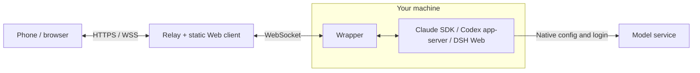

# cc-remote

**Use Claude Code, Codex and DeepSeek Harness on your machine from your phone or browser.**

Self-hosted · Multiple sessions and devices · Live tool activity · Code / Work · PWA

**Product version: v3.0.0** · Wire protocol v65

[中文](README.md) · [Engine comparison](#engines-and-features) · [Quick start](#quick-start) ·
[Install and upgrade](#install-and-upgrade) · [Documentation](#documentation) · [Changelog](CHANGELOG.md)

cc-remote brings your local agent's sessions, tool activity, files and controls to
remote clients. Start a task on your computer, check progress from your phone,
answer a question or steer the task, then return to the same conversation.
Model authentication, provider configuration and tool execution remain with the
local engine. cc-remote does not proxy model APIs.

This README describes the current source tree. For a published package, read the
documentation at its tag: the same product version does not guarantee the same
features or wire protocol across different commits.


## What you can do

- **Handle several tasks at once.** Group sessions by directory, search, pin,
  rename and leave them running in the background. Switching views does not stop
  a task. History is paged, with tool details loaded when expanded.
- **Follow the work.** Read streaming replies, engine-provided reasoning
  summaries, plans, tool calls, command output, file changes and approvals.
  Codex and DSH support steering or queueing while busy; Claude supports
  interrupt-and-send or queueing.
- **Manage longer tasks.** `/goal` exposes each engine's native progress, budget
  and controls. Claude and Codex also offer temporary `/btw` side conversations
  while the main task continues.
- **Read files directly.** File and directory links in messages connect to
  `/open` and the preview panel: source, Markdown, images, HTML, PDF, audio and XLSX.
- **Connect machines and accounts.** Pair, switch and revoke devices in Device
  Center. Claude/Codex accounts can use separate native authentication, session
  and extension directories.
- **Work from a phone.** Compact engine menus, light/dark themes, image zoom, PWA
  installation and optional background notifications. Notifications default to
  generic status; showing a session name requires an explicit opt-in.

### Code and Work

**Code** operates in your chosen project directory for development, debugging and
other agent tasks. All three engines support it.

**Work** is a separate Claude/Codex workspace for documents, spreadsheets,
presentations and research. It includes private projects, file/link/note sources,
work templates, artifacts, and one-shot, daily or weekly schedules. Each work
item has its own directory; add material through attachments or the project
library. Work sessions and material are separate from Code. DSH does not offer
Work in this adapter.

## Engines and features

This table describes **capabilities connected in cc-remote**. Models, permissions
and extensions still depend on the native installation on the selected device.
DSH commands also depend on the Agent Preset chosen when creating the session.

| Capability | Claude Code | Codex | DeepSeek Harness (DSH) |
|---|---|---|---|
| Connection | Daily Claude CLI + Agent SDK | Official app-server, shared daemon | Local Web profile + cc-remote bridge |
| Code / Work | Both | Both | Code only |
| Models and reasoning | Native models and supported levels | Native models, reasoning effort, service tier | DeepSeek V4.1 Flash only; native reasoning levels |
| Plan | Native Plan mode | Native Plan collaboration mode | Native `/plan` in Standard / PTC |
| Goal | Completion condition, check count, latest feedback, token usage and elapsed time | Objective, optional token budget, pause/resume, complete and clear | Objective, native round limit, continuation state, pause/resume and clear |
| `/btw` side conversation | Supported | Supported | Not connected |
| Archive and delete | Archive, restore, delete | Archive, restore, delete | One-way archive only; history and export remain available |
| Fork sessions | Supported | Supported, including a separate worktree | Same-directory forks at completed boundaries |
| Engine-specific tools | Hook management, native questions and tool approvals | Review, idle-session directory migration, status and account limits | Subagents, background jobs, file/session references, complete session ZIP export |
| Extensions | Skills, plugins, MCP, Hooks and supported management | Skills, plugins, Apps, MCP; read-only Hooks | Native commands and Skills; installation/configuration stays in DSH |

**The integrated DSH version is `0.1.5-rc.2`.** Choose **Standard** or **PTC**
from **New session → Agent Preset** to use the Goal/Plan features described here.
Existing Minimal sessions retain their original capabilities. Changing the
model, reasoning level or permissions does not change their Preset.
DSH Plan organizes the planning workflow; it does not replace permission settings
or narrow the tool sandbox. See [DSH setup, modes and boundaries](integrations/dsh/README.md).

### Goal budgets are separate from context capacity

`/goal` opens the current engine's goal dialog, with controls matching native capabilities:

- **Claude** uses a completion condition and native check feedback. It shows
  usage and elapsed time, without a Codex-style token-budget input.
- **Codex** can set a cumulative token budget for a goal or leave it unlimited.
  That budget does not increase the context window.
- **DSH** uses a native round limit, defaulting to 256 when creating a goal.
  Increasing an exhausted limit and resuming continuation are separate actions.

## Common operations

Type `/` in the composer to see commands available for the current engine.

| Entry | Purpose |
|---|---|
| `/model` | Choose a model and reasoning level |
| `/goal` | Open the goal dialog; DSH requires a supporting Preset |
| `/plan` | Enter planning; exit with `/normal` in Claude/Codex or `/plan off` in DSH |
| `/btw [question]` | Start a temporary side conversation based on the current Claude/Codex session |
| `/open [path]` | Browse directories; also available from More → Session files |
| `/preview <path>` | Open a file preview |
| `/diff` | Inspect current project Git changes |
| `/context` | Inspect context usage; the small composer gauge opens it too |
| `/autocompact` | Claude/Codex session context settings, with the semantics below |
| `/status` | Codex thread, configuration, usage and account limits |
| `/skills` | Inspect engine Skills; Claude/Codex also have `/extensions` and related catalogs |

On desktop, **Enter sends and Shift+Enter inserts a newline** by default. Assistant
question dialogs use the same keys; **Esc** dismisses the dialog while leaving
the question unanswered. Confirming an IME composition does not submit it.

### Context and automatic compaction

In **Codex Code**, `/autocompact 300k` sets the session's maximum usable context
to **300,000 tokens**. Automatic compaction targets roughly **95%** of that
capacity, subject to the effective threshold shown in the popover and Codex's
native limits. The gauge uses native compaction estimates rather than treating
last-request usage as the compaction trigger. A temporary read failure keeps the
last valid reading for the same session and model, without repeated loading notices.

A setting saved while busy may remain pending until the thread is idle and other
clients release it. `/autocompact default` restores native defaults. This Codex
override does not apply to Work or temporary side conversations. Restore defaults
before switching to a model with a smaller context window.

**Claude** keeps native automatic compaction by default, with an explicit automatic
or `100K–1M` session-window choice available. Lowering it first verifies a native
compact boundary. **DSH** reports native context estimates and model capacity;
it does not expose Codex's window override. Reading context creates no model turn.

## Files and previews

Code's `/open` starts in the session directory and supports parent directories,
absolute paths and `~`. Regular files readable by the Wrapper's OS user can be
viewed even when another user owns them. External files are read-only by default;
Work stays within its own workspace. Directory reads are paged and non-recursive.
Symlinks and special files are not opened.

| File | Preview and limits |
|---|---|
| Source, text, Markdown | Line navigation and rendered previews; Markdown successfully written by this session supports conflict-safe editing |
| Images, PDF | Direct previews; images support a lightbox and zoom |
| Audio | Playback, seeking, speed and download; up to 8 MiB, with codec support determined by the browser |
| XLSX | Worksheet tabs and saved cell values on macOS/Linux without Office. No formula evaluation or external-link execution. Size, row/column and total-cell bounds apply; truncation is indicated and the original can be downloaded |
| DOC/DOCX/ODT/RTF, XLS/ODS, PPT/PPTX/ODP | Temporary PDF conversion with LibreOffice + bubblewrap on a Linux Wrapper; unavailable without that conversion environment |
| HTML | Sanitized, scriptless file preview; use [Remote Viewer](docs/remote-viewer.md) for interactive multi-file static pages |

Parsing/conversion happens on the Wrapper host or in the browser. Files return to
the requester through an authenticated connection. The relay does not persist
originals or previews. Viewer defaults to the main site origin without another
preview domain; it does not proxy arbitrary private-network services.

## Architecture



Wrapper connects outbound to Relay; the device needs no public inbound port.
Relay handles the control connection while the native engine connects directly
to its model service. The two connections are configured independently.

<a id="quick-start-local-one-machine-5-min"></a>

## Quick start

First run Relay, Wrapper and the web client on the agent's machine. Source
development/builds use **Python 3.13 and Node 24**, matching CI and [`.nvmrc`](.nvmrc).

Prepare at least one working engine:

- **Claude:** daily Claude Code `>= 2.1.258`, normally at `~/.local/bin/claude`.
  Wrapper launches that CLI; the Python Agent SDK is pinned to `0.2.151`.
- **Codex:** an authenticated official CLI. Shared control requires both
  `codex app-server daemon --help` and `codex app-server proxy --help`.
- **DSH:** separately install and start the `0.1.5-rc.2` Web profile, then configure
  its bridge and private pairing file using the [integration guide](integrations/dsh/README.md).

### 1. Install dependencies and build

```bash
git clone https://github.com/muggle-stack/cc-remote.git
cd cc-remote
# For development-branch features, check out that branch before installing/building.
python3.13 -m venv .venv
.venv/bin/python -m pip install --require-hashes --only-binary=:all: -r requirements.lock
# Use Node 24 for the following commands.
npm --prefix web ci
npm --prefix web run build
```

### 2. Configure local access

Copy the template only for a first setup. Edit an existing `.env` in place to
preserve its secrets.

```bash
install -m 600 .env.example .env
openssl rand -hex 32   # Generate SESSION_SECRET.
openssl rand -hex 32   # Generate a separate WRAPPER_TOKEN.
```

Set actual values in `.env`; angle-bracket values below are placeholders:

```ini
LOGIN_PASSWORD=<strong web login password>
SESSION_SECRET=<first random value>
WRAPPER_TOKEN=<second random value>
PUBLIC_ORIGIN=http://127.0.0.1:8765
RELAY_URL=ws://127.0.0.1:8765/ws
WEB_STATIC_DIR=web/dist
CC_CWD=/absolute/path/to/project
CLAUDE_BIN=
```

An empty `CLAUDE_BIN` selects the default path; an override must be an absolute
path. Configure DSH's `CC_REMOTE_DSH_CONNECTION_FILE` separately as documented.
The local `.env` is for development; production credential storage is covered in
[Installation](docs/installation_en.md).

### 3. Start

Open two terminals in the repository directory and run separately:

```bash
# Terminal 1
.venv/bin/python -m cc_remote.relay
```

```bash
# Terminal 2
.venv/bin/python -m cc_remote.wrapper
```

Open [http://127.0.0.1:8765](http://127.0.0.1:8765) and sign in with the configured
password. Check that the device is online, then select an engine and session.
This address is local to the computer. For phone access, use the public deployment
below or configure a restricted LAN/Tailscale entry point.

<a id="one-command-github-release-install-recommended-for-production"></a>
<a id="production-deploy-public-vps-relay--wrapper-on-your-machine"></a>

## Install and upgrade

| Scenario | Guide |
|---|---|
| Use current features (recommended) or a development branch | [Source deployment](docs/installation_en.md#source-install): use one tested snapshot |
| Install a selected published version | [Release packages](docs/installation_en.md#release-install): confirm the tag includes the needed features; Linux Relay and macOS/glibc Linux Wrappers have x86_64 / arm64 packages |
| Containers or an existing reverse proxy | [Deployment reference](deploy/README.md#container-deploy-docker-and-the-nginx-alternative) |
| Add DSH | [Local Web profile, bridge and pairing](integrations/dsh/README.md#connect-a-local-dsh) |

The production Relay keeps immutable versions under `/opt/cc-remote/releases/`
and switches `/opt/cc-remote/current` atomically. Preserve external configuration
and private-state snapshots before upgrading. Relay, Web and every Wrapper must
come from one source snapshot or coordinated artifact set. Mismatched protocols
cannot connect.

[deploy/README.md](deploy/README.md) owns the release procedure, rollback and
acceptance checks. AI-assisted deployment uses the repository's
[deployment skill](.agents/skills/cc-remote-deploy/SKILL.md). Verify that each Codex
account's daily CLI and Wrapper use the same official daemon. Attaching an
installed Codex App is a separate optional step, with distinct
[macOS](docs/codex-desktop-launcher.md) and [Linux](docs/codex-desktop-linux.md)
procedures, independent of core deployment success. Upgrading cc-remote does not
upgrade or restart DSH for you.

## Configuration and native clients

- **Claude:** sessions owned by native CLI/Desktop/Agent View are mirrored
  read-only until the user explicitly takes over. The official `claude` command
  remains unchanged.
- **Codex Code:** coordinates through the official shared daemon. A private stdio
  fallback lacks the same bidirectional sharing and does not satisfy shared-control
  deployment acceptance. Work uses private processes.
- **DSH:** connects to the already-running local Web service. Closing Wrapper
  detaches subscriptions while native tasks continue; the Stop button explicitly
  cancels a task.

See [Configuration, accounts and data](docs/configuration_en.md) for account
directories, proxies, device policy, notifications and environment variables.
Claude/Codex profiles keep configuration and authentication separate; choosing an
account does not send its credentials to the web client or relay.

<a id="security-please-read"></a>

## Security and data

**Treat anyone who can sign in and use Code as holding remote agent/shell access
to the Wrapper machine.** Code defaults are permissive. Work's private-directory
policy is not a replacement for separate OS users, containers or virtual machines.

- Use HTTPS/WSS publicly and keep credentials outside source/release directories.
  Linux production services use root-only environment files; the macOS installer
  uses the current user's private configuration.
- Web login uses an HttpOnly, SameSite=Strict cookie with exact WebSocket Origin
  checks. Wrapper credentials travel in request headers; device authorization is
  scoped by `machine_id`.
- Session sources and Work data remain on the device; browsers cache history
  projections. Relay forwards conversation traffic without persisting chats or
  artifacts. Control metadata such as device registrations and Push subscriptions
  is persisted.
- Browsing history and reading context do not request model inference. Messages,
  side conversations and native goal continuation still use the model account's
  allowance or billing.

## Documentation

| Guide | Contents |
|---|---|
| [Installation and upgrades](docs/installation_en.md) | Release packages, source, pairing, network access |
| [Configuration, accounts and data](docs/configuration_en.md) | Profiles, environment variables, authentication, queues and history |
| [Deployment procedure](deploy/README.md) | Immutable releases, rollback, shared control and acceptance |
| [DSH integration](integrations/dsh/README.md) | Native Presets, Goal/Plan, search, subagents, export and limits |
| [Remote Viewer](docs/remote-viewer.md) | Interactive static pages, Bridge/Isolated modes |
| Codex App: [macOS](docs/codex-desktop-launcher.md) / [Linux](docs/codex-desktop-linux.md) | Optional App, daily CLI and Wrapper on one daemon |
| [Codex App tools](docs/codex-app-tools.md) | Optional App-control MCP |
| [Changelog](CHANGELOG.md) | Version changes and migrations |

## Development

Use Node 24 for the web client and the repository's Python dependency locks.
Common tests that do not call a live model:

```bash
.venv/bin/python -m pip install -r requirements-dev.txt
.venv/bin/python -m pytest
npm --prefix web run test:reliability
npm --prefix web run test:history-browser
npm --prefix web run test:viewer
npm --prefix web run test:dsh
npm --prefix web run lint
npm --prefix web run build
```

The complete commit/PR gate is in [AGENTS.md](AGENTS.md#commit-and-pr-gate).
[Live probes](scripts/live/) and [isolated DSH acceptance](integrations/dsh/README.md#verification)
run separately; live model probes may spend tokens and are not default unit tests.
Use `npm --prefix web run dev` for the UI dev server, or the built Relay-served
web client for same-origin integration.

## FAQ

- **Why are DSH `/goal` and `/plan` unavailable?** Check the session's Preset.
  Minimal does not supply them; create a Standard/PTC session. Persistent command
  discovery errors instead require checking the DSH bridge and pairing connection.
- **Why can I list a file but not preview it?** Previews also require a regular
  file, a supported format and size, and OS read permission. XLSX needs no Office;
  other Office formats need the Linux conversion sandbox.
- **Does restarting Wrapper lose history?** Persisted history remains. Live-tail
  replay and ordinary pending messages are bounded in-memory state and are not
  guaranteed across a Wrapper restart. Work schedules have separate durable records.
- **What happens when Relay restarts or moves?** Browsers reconnect and sign in
  again; device-local sessions remain. Moving Relay also requires migrating or
  recreating device authorization, Push and other control configuration, not just
  changing its address.
- **Does phone access need an inbound port on my computer?** No. Wrapper connects
  outbound; the public entry point is on the Relay host.

<details>
<summary>More interface screenshots</summary>

These show Claude/Codex interface examples. Menus vary by engine and version.


</details>

## License

MIT — see [LICENSE](LICENSE).
